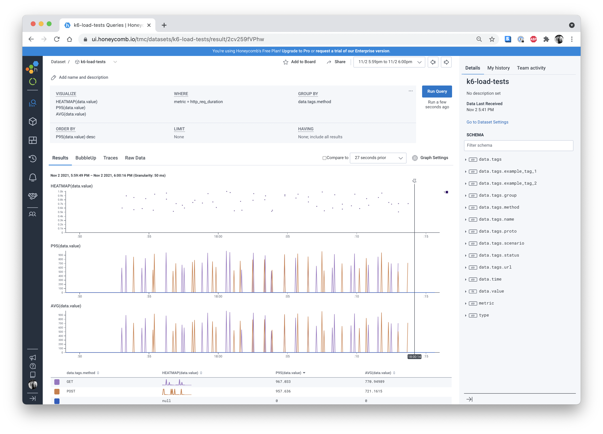

# k6-to-honeycomb

k6-to-honeycomb is a program that sends [k6](https://k6.io) results into Honeycomb for
visualization and analysis.

## Getting Started

k6-to-honeycomb is a [Go](https://golang.org) program, the most straightforward way to install it is to first install
[Go](https://golang.org) 1.17+.

```shell
$ go install github.com/tmc/k6-to-honeycomb/cmd/k6-to-honeycomb@latest
```

This will place a `k6-to-honeycomb` binary into your `$GOPATH/bin` directory which by default is
located at `$HOME/go/bin`. Typically you would place that directory into your system's PATH.

## Configuration

The Honeycomb write API key can be provided with the `-k` command line flag. If not provided it will attempt to be read from the `HC_API_KEY` environment variable.

## Example Use

Here is an exmaple of running k6 with streaming JSON output that this program can ingest and ship off to honeycomb.

Example k6 invocation (note --out json= parameter):

```shell
$ k6 run -u 1 -d 10s --out json=./output.json
```

You can then ship these events to honeycomb like so:

```shell
$ k6-to-honeycomb output.json
```

By default this will send to a `k6-load-tests` dataset but this is configurable with the -d parameter like so:

```shell
$ k6-to-honeycomb -d k6-load-test-results output.json
```

## Example Results


